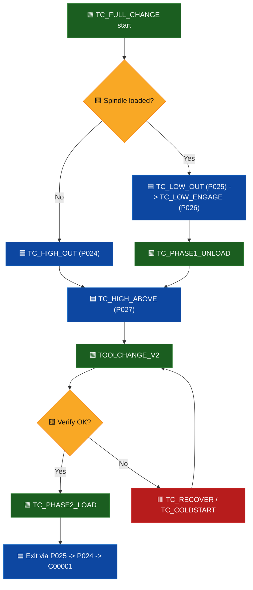

## Hardened Tool Changer Process Outline

This outline documents the active hardened tool-change flow in execution order and includes full source for each job.

> 🟩 **Green = normal flow**  
> 🟨 **Yellow = branch/decision**  
> 🟥 **Red = recovery/fault path**  
> 🟦 **Blue = motion waypoints**

<!-- Print pagination helper: force new page after cover section -->
<div style="page-break-after: always;"></div>

### Active jobs in this flow
- `TC_FULL_CHANGE.JBI` (station-level entrypoint with robot motion)
- `TOOLCHANGE_V2.JBI` (logical tool index command/verify with retry)
- `TC_CHK_READY.JBI` (permissive checks)
- `TC_PHASE1_UNLOAD.JBI` (release/unload current tool)
- `TC_PHASE2_LOAD.JBI` (grab/lock requested tool)
- `TC_SET_TOOL_INDEX.JBI` (send index command and wait cycle)
- `TC_VERIFY_TOOL.JBI` (verify logical + physical result)
- `TC_RECOVER.JBI` (fault clear + escalation)
- `TC_COLDSTART.JBI` (full homing/reset recovery)

### Position variable naming
- `P024 = TC_HIGH_OUT`
- `P025 = TC_LOW_OUT`
- `P026 = TC_LOW_ENGAGE`
- `P027 = TC_HIGH_ABOVE`

<!-- Print pagination helper -->
<div style="page-break-before: always;"></div>

## Step-by-step execution order



### 🟩 1) Station entrypoint (`TC_FULL_CHANGE`)
1. Read requested tool arg (`1..6`) into `B009`; initialize `B098=0`.
2. Validate request range; return `B098=71` if invalid.
3. Pre-check changer readiness using `TC_CHK_READY`; return `B098=72` if not ready.
4. Move into station (`C00000`) and branch by spindle state:
   - 🟦 loaded path: go `TC_LOW_OUT (P025) -> TC_LOW_ENGAGE (P026)`, run `TC_PHASE1_UNLOAD`
   - 🟦 load-only path (empty/unlocked): go `TC_HIGH_OUT (P024)`
5. Move to exchange point `TC_HIGH_ABOVE (P027)` 🟦.
6. Set `I025=B009`; call `TOOLCHANGE_V2 ARGFI025` to command changer index.
7. Retract to `TC_LOW_ENGAGE (P026)`; run `TC_PHASE2_LOAD`.
8. Exit station via `TC_LOW_OUT (P025) -> TC_HIGH_OUT (P024) -> C00001`.

### 🟩 2) Logical tool-change core (`TOOLCHANGE_V2`)
1. Read request arg into `B009`, clear `B098`.
2. Read changer report `IG#(30)` into `B010`.
3. Normalize stale state: force `B010=0` if spindle is empty (`IN#196=ON`) or unlocked (`IN#194=OFF`).
4. If `B009=B010` and `B010<>0`, return early (no motion index).
5. Run `TC_CHK_READY`; if not ready, run `TC_RECOVER` 🟥, then `TC_CHK_READY` again.
6. First attempt: `TC_SET_TOOL_INDEX` then `TC_VERIFY_TOOL`.
7. If verify fails: run `TC_RECOVER` 🟥, `TC_CHK_READY`, then retry `TC_SET_TOOL_INDEX` + `TC_VERIFY_TOOL` once.
8. If second verify fails, message `S012` and return with nonzero `B098`.

### 🟨 3) Readiness, command, verify, and recovery helpers
1. `TC_CHK_READY`: verifies no fault + motor enabled + homed + ready.
2. `TC_SET_TOOL_INDEX`: writes request to `OG#(26)`, pulses `OT#(209)`, waits motion start/stop and ready.
3. `TC_VERIFY_TOOL`: checks requested-vs-reported tool, lock state, empty state, invalid/not-ready/fault bits.
4. `TC_RECOVER`: pulse clear fault; escalate to `TC_COLDSTART` if fault remains; require final ready check.
5. `TC_COLDSTART`: full reset/home handshake path to return changer to known idle/home state.

### 🟦 4) Physical spindle phase helpers
1. `TC_PHASE1_UNLOAD`: if loaded, extend drawbar and confirm spindle empty.
2. `TC_PHASE2_LOAD`: return/seat drawbar and confirm locked + not empty.

<!-- Print pagination helper -->
<div style="page-break-before: always;"></div>

## Appendix A: I/O used by hardened toolchange

### Input signals (`IN#`)
- `IN#(193)` = `SPINDLE_DRAWBAR_EXTENDED`
- `IN#(194)` = `SPINDLE_TOOL_LOCKED`
- `IN#(196)` = `SPINDLE_NO_TOOL_LOADED`
- `IN#(204)` = `CHANGER_READY_AT_POSITION`
- `IN#(205)` = `CHANGER_HOME_COMPLETE`
- `IN#(206)` = `CHANGER_MOTOR_ENABLED`
- `IN#(207)` = `CHANGER_FAULT_PRESENT`
- `IN#(208)` = `CHANGER_IN_MOTION`
- `IN#(209)` = `CHANGER_IDLE_STATE_BIT_209` (used by coldstart idle-state check)
- `IN#(210)` = `CHANGER_IDLE_STATE_BIT_210` (used by coldstart idle-state check)
- `IN#(211)` = `CHANGER_IDLE_STATE_BIT_211` (used by coldstart idle-state check)
- `IN#(212)` = `CHANGER_INVALID_TOOL_INDICATION`
- `IN#(213)` = `CHANGER_NOT_READY_INDICATION`

### Output signals (`OT#`)
- `OT#(185)` = `SPINDLE_DRAWBAR_EXTEND_CMD`
- `OT#(186)` = `SPINDLE_DRAWBAR_RETURN_CMD`
- `OT#(209)` = `CHANGER_EXECUTE_MOVE_PULSE`
- `OT#(212)` = `CHANGER_FAULT_CLEAR_PULSE`

### Input groups (`IG#`)
- `IG#(30)` = `CHANGER_CURRENT_TOOL_REPORT`

### Output groups (`OG#`)
- `OG#(1)` = `CHANGER_EXECUTE_LATCH_GROUP` (set to `1` before coldstart execute pulse)
- `OG#(26)` = `CHANGER_REQUESTED_TOOL_CMD`
- `OG#(27)` = `CHANGER_MODE_CMD_GROUP` (`2` used for home request in `TC_COLDSTART`)

<!-- Print pagination helper -->
<div style="page-break-before: always;"></div>

## Full code reference

### `TC_FULL_CHANGE.JBI`
```jbi
/JOB
//NAME TC_FULL_CHANGE
//POS
///NPOS 2,0,0,4,0,0
///TOOL 1
///POSTYPE PULSE
///PULSE
C00000=134228,5015,-129062,-137591,141260,38873
C00001=134230,5015,-129062,-137594,141259,38870
///POSTYPE BASE
///RECTAN
///RCONF 0,0,0,0,0,0,0,0,0,0,0,0,0,0,0,0,0,0,0,0,0,0,0,0
P00024=754.999,1320.999,-329.000,-179.9987,-0.0019,-0.0018
P00025=755.000,1321.000,-446.500,-179.9988,-0.0019,-0.0019
P00026=768.500,1482.000,-446.500,179.9936,-0.0142,-0.0149
P00027=768.500,1482.000,-329.107,179.9943,-0.0139,-0.0147
//ARGINFO
///ARGTYPE B,,,,,,,
///COMMENT
TOOL NUMBER
//INST
///DATE 2026/05/08 09:42
///ATTR SC,RW
///GROUP1 RB1
///LVARS 1,0,0,0,0,0,0,0
NOP
'TC_FULL_CHANGE PURPOSE:
'COMPLETE STATION TOOLCHANGE PROGRAM (MOTION + I/O + VERIFY)
'ARG#1 = REQUESTED TOOL NUMBER (1..6)
'B098 CODES:
' 0   = SUCCESS
' 71  = INVALID REQUESTED TOOL
' 72  = CHANGER NOT READY BEFORE APPROACH
' 73  = PHASE 1 UNLOAD FAILURE
' 74  = INDEX/VERIFY FAILURE IN TOOLCHANGE_V2
' 75  = PHASE 2 LOAD FAILURE
'READ REQUESTED TOOL ARG#1
GETARG LB000 IARG#(1)
SET B009 LB000
SET B098 0
'VALIDATE REQUESTED TOOL RANGE
IFTHENEXP B009<1
	 SET B098 71
	 RET
ENDIF
IFTHENEXP B009>6
	 SET B098 71
	 RET
ENDIF
'PRE-CHECK CHANGER READY BEFORE ENTERING STATION
CALL JOB:TC_CHK_READY
IFTHENEXP B098<>0
	 SET B098 72
	 RET
ENDIF
'MOVE TO STATION APPROACH
MOVJ C00000 VJ=0.78 PL=0
'IF SPINDLE IS EMPTY/UNLOCKED, USE HIGH-OUT APPROACH FOR LOAD-ONLY PATH
IFTHENEXP IN#(196)=ON
	 JMP *LOAD_ONLY_APPROACH
ENDIF
IFTHENEXP IN#(194)=OFF
	 JMP *LOAD_ONLY_APPROACH
ENDIF
MOVJ P025 VJ=25.00 PL=0
'UNLOAD PATH: MOVE INTO RELEASE POSITION AND RUN PHASE 1
DOUT OT#(186) OFF
TIMER T=0.10
MOVL P026 V=200.0 PL=0
CALL JOB:TC_PHASE1_UNLOAD
IFTHENEXP B098<>0
	 SET B098 73
	 RET
ENDIF
JMP *SKIP_UNLOAD
*LOAD_ONLY_APPROACH
MOVL P024 V=300.0 PL=0
*SKIP_UNLOAD
'MOVE TO EXCHANGE POSITION
MOVL P027 V=300.0 PL=0
'INDEX CHANGER TO REQUESTED TOOL (USES B009)
SET I025 B009
CALL JOB:TOOLCHANGE_V2 ARGFI025
IFTHENEXP B098<>0
	 MOVL P026 V=300.0 PL=0
	 SET B098 74
	 RET
ENDIF
'RETRACT BEFORE LOAD/LOCK PHASE
MOVL P026 V=300.0 PL=0
'PHASE 2: GRAB/LOCK NEW TOOL
CALL JOB:TC_PHASE2_LOAD
IFTHENEXP B098<>0
	 SET B098 75
	 RET
ENDIF
'LEAVE STATION
MOVL P025 V=300.0 PL=0
MOVL P024 V=300.0 PL=0
MOVJ C00001 VJ=35.00 PL=0
'NORMAL SUCCESS
SET B098 0
END
```

<!-- Print pagination helper -->
<div style="page-break-before: always;"></div>

### `TOOLCHANGE_V2.JBI`
```jbi
/JOB
//NAME TOOLCHANGE_V2
//POS
///NPOS 0,0,0,0,0,0
//ARGINFO
///ARGTYPE B,,,,,,,
///COMMENT
TOOL NUMBER
//INST
///DATE 2026/05/07 12:39
///ATTR SC,RW
///GROUP1 RB1
///LVARS 1,0,0,0,0,0,0,0
NOP
'TOOLCHANGE_V2 PURPOSE:
'MAIN HARDENED TOOL CHANGE ENTRYPOINT
'- ACCEPTS REQUESTED TOOL ARG
'- NORMALIZES STALE TOOL STATE USING PHYSICAL SPINDLE INPUTS
'- ENFORCES READINESS + RECOVERY
'- COMMANDS TOOL MOVE
'- VERIFIES RESULT
'- RETRIES ONCE BEFORE FINAL FAIL
'KEY REGISTERS:
'B009 = REQUESTED TOOL
'B010 = REPORTED/CORRECTED CURRENT TOOL
'B098 = STATUS CODE FROM HELPER JOBS
'MSG S010 = READY FAILURE AFTER RECOVERY
'MSG S011 = READY FAILURE BEFORE RETRY ATTEMPT
'MSG S012 = VERIFY FAILURE AFTER RETRY
'READ TOOL REQUEST ARG#1
GETARG LB000 IARG#(1)
SET B009 LB000
'CLEAR STATUS
SET B098 0
'SYNC REPORTED TOOL WITH PHYSICAL SPINDLE STATE
'READ REPORTED TOOL FROM CHANGER
DIN B010 IG#(30)
IFTHENEXP IN#(196)=ON
	 'PHYSICALLY EMPTY SPINDLE OVERRIDES STALE REPORTED TOOL
	 SET B010 0
ENDIF
IFTHENEXP IN#(194)=OFF
	 'NOT LOCKED ALSO MEANS DO NOT TRUST TOOL-AS-LOADED
	 SET B010 0
ENDIF
'ONLY SKIP IF TOOL MATCHES AND SPINDLE IS PHYSICALLY LOADED/LOCKED
IFTHENEXP B009=B010
	 IFTHENEXP B010<>0
		  'EARLY SUCCESS: REQUESTED TOOL ALREADY PRESENT
		  RET
	 ENDIF
ENDIF
'READINESS CHECK
CALL JOB:TC_CHK_READY
IFTHENEXP B098<>0
	 'FIRST ESCALATION: TRY RECOVERY BEFORE GIVING UP
	 CALL JOB:TC_RECOVER
	 CALL JOB:TC_CHK_READY
	 IFTHENEXP B098<>0
		  'NOT READY EVEN AFTER RECOVERY
		  MSG S010
		  RET
	 ENDIF
ENDIF
'FIRST COMMAND ATTEMPT
CALL JOB:TC_SET_TOOL_INDEX
CALL JOB:TC_VERIFY_TOOL
IFTHENEXP B098=0
	 'SUCCESS ON FIRST TRY
	 RET
ENDIF
'RETRY ONCE, THEN COLDSTART PATH INSIDE TC_RECOVER
'RECOVER + RECHECK BEFORE RETRYING COMMAND
CALL JOB:TC_RECOVER
CALL JOB:TC_CHK_READY
IFTHENEXP B098<>0
	 'COULD NOT RESTORE READY STATE FOR RETRY
	 MSG S011
	 RET
ENDIF
'SECOND AND FINAL COMMAND ATTEMPT
CALL JOB:TC_SET_TOOL_INDEX
CALL JOB:TC_VERIFY_TOOL
IFTHENEXP B098<>0
	 'FINAL FAILURE AFTER RETRY
	 MSG S012
ENDIF
END
```

<!-- Print pagination helper -->
<div style="page-break-before: always;"></div>

### `TC_CHK_READY.JBI`
```jbi
/JOB
//NAME TC_CHK_READY
//POS
///NPOS 0,0,0,0,0,0
//INST
///DATE 2026/05/07 12:39
///ATTR SC,RW
///GROUP1 RB1
NOP
'TC_CHK_READY PURPOSE:
'VERIFY ALL REQUIRED CHANGER PERMISSIVES BEFORE ANY TOOL COMMAND
'RETURNS RESULT IN B098
' 0  = READY
' 31 = FAULT PRESENT
' 32 = MOTOR NOT ENABLED
' 33 = NOT HOMED
' 34 = NOT AT POSITION / NOT READY
'STATUS CODE: B098 (0 = READY)
SET B098 0
'FAULT MUST BE CLEAR
IFTHENEXP IN#(207)=ON
	 SET B098 31
	 'EARLY EXIT ON FIRST FAILED PERMISSIVE
	 RET
ENDIF
'MOTOR ENABLE MUST BE TRUE
IFTHENEXP IN#(206)=OFF
	 SET B098 32
	 'EARLY EXIT ON FIRST FAILED PERMISSIVE
	 RET
ENDIF
'HOME MUST BE COMPLETE
IFTHENEXP IN#(205)=OFF
	 SET B098 33
	 'EARLY EXIT ON FIRST FAILED PERMISSIVE
	 RET
ENDIF
'TOOL CHANGER MUST BE READY/AT POSITION
IFTHENEXP IN#(204)=OFF
	 SET B098 34
	 'EARLY EXIT ON FIRST FAILED PERMISSIVE
	 RET
ENDIF
END
```

<!-- Print pagination helper -->
<div style="page-break-before: always;"></div>

### `TC_SET_TOOL_INDEX.JBI`
```jbi
/JOB
//NAME TC_SET_TOOL_INDEX
//POS
///NPOS 0,0,0,0,0,0
//INST
///DATE 2026/05/07 12:39
///ATTR SC,RW
///GROUP1 RB1
NOP
'TC_SET_TOOL_INDEX PURPOSE:
'ISSUE TOOL INDEX COMMAND TO CHANGER AND WAIT FOR MOTION CYCLE
'USES B009 AS REQUESTED TOOL NUMBER
'USES REQUESTED TOOL B009
SET B098 0
'WRITE REQUESTED TOOL BITS TO OUTPUT GROUP
DOUT OG#(26) B009
'EXECUTE MOVE EDGE
PULSE OT#(209)
'EXPECT MOTION TO START AND FINISH
WAIT IN#(208)=ON
WAIT IN#(208)=OFF
'READY BIT MUST RETURN ON
WAIT IN#(204)=ON
END
```

<!-- Print pagination helper -->
<div style="page-break-before: always;"></div>

### `TC_VERIFY_TOOL.JBI`
```jbi
/JOB
//NAME TC_VERIFY_TOOL
//POS
///NPOS 0,0,0,0,0,0
//INST
///DATE 2026/05/07 12:39
///ATTR SC,RW
///GROUP1 RB1
NOP
'TC_VERIFY_TOOL PURPOSE:
'VERIFY LOGICAL + PHYSICAL SUCCESS AFTER A TOOL COMMAND
'B098 CODES:
' 0  = VERIFY PASS
' 41 = REPORTED TOOL DOES NOT MATCH REQUEST
' 45 = TOOL NOT LOCKED (IN#194=OFF)
' 46 = NO TOOL LOADED (IN#196=ON)
' 42 = INVALID TOOL BIT SET BY CHANGER
' 43 = NOT READY BIT SET BY CHANGER
' 44 = FAULT PRESENT
'FIRST-FAILURE-WINS: LATER CHECKS ONLY RUN IF B098 IS STILL 0
'VERIFY REQUEST B009 AGAINST REPORTED IG#(30)
SET B098 0
'READ CURRENT TOOL VALUE FROM INPUT GROUP 30
DIN B010 IG#(30)
IFTHENEXP B010<>B009
	 SET B098 41
ENDIF
IFTHENEXP B098=0
	 'PHYSICAL LOCK MUST BE TRUE
	 IFTHENEXP IN#(194)=OFF
		  SET B098 45
	 ENDIF
ENDIF
IFTHENEXP B098=0
	 'SPINDLE MUST NOT REPORT EMPTY
	 IFTHENEXP IN#(196)=ON
		  SET B098 46
	 ENDIF
ENDIF
IFTHENEXP B098=0
	 'CHANGER-SIDE INVALID TOOL INDICATION
	 IFTHENEXP IN#(212)=ON
		  SET B098 42
	 ENDIF
ENDIF
IFTHENEXP B098=0
	 'CHANGER-SIDE NOT READY INDICATION
	 IFTHENEXP IN#(213)=ON
		  SET B098 43
	 ENDIF
ENDIF
IFTHENEXP B098=0
	 'FINAL FAULT CHECK
	 IFTHENEXP IN#(207)=ON
		  SET B098 44
	 ENDIF
ENDIF
END
```

<!-- Print pagination helper -->
<div style="page-break-before: always;"></div>

### `TC_RECOVER.JBI`
```jbi
/JOB
//NAME TC_RECOVER
//POS
///NPOS 0,0,0,0,0,0
//INST
///DATE 2026/05/07 12:39
///ATTR SC,RW
///GROUP1 RB1
NOP
'RECOVER TO A KNOWN READY STATE
'B098 RETURN CODES:
' 0  = RECOVERY SUCCESS
' 91 = FAILED TO REACH READY AFTER RECOVERY STEPS
SET B098 0
'TRY SIMPLE FAULT CLEAR FIRST
IFTHENEXP IN#(207)=ON
	 'SHORT CLEAR PULSE TO RESET LATCHED FAULTS
	 PULSE OT#(212) T=0.05
	 TIMER T=0.10
ENDIF
'IF STILL FAULTED, RUN FULL COLDSTART
IFTHENEXP IN#(207)=ON
	 'ESCALATION PATH
	 CALL JOB:TC_COLDSTART
ENDIF
'FINAL READINESS CHECK
CALL JOB:TC_CHK_READY
IFTHENEXP B098<>0
	 'NORMALIZE ANY NON-READY RESULT INTO RECOVERY FAILURE CODE
	 SET B098 91
ENDIF
END
```

<!-- Print pagination helper -->
<div style="page-break-before: always;"></div>

### `TC_COLDSTART.JBI`
```jbi
/JOB
//NAME TC_COLDSTART
//POS
///NPOS 0,0,0,0,0,0
//INST
///DATE 2026/03/10 13:49
///ATTR SC,RW
///GROUP1 RB1
NOP
'TC_COLDSTART PURPOSE:
'FORCE THE TOOL CHANGER INTO A KNOWN GOOD HOME/IDLE STATE
'USED AFTER FAULTS OR MAJOR STATE DESYNC CONDITIONS
MSG S000
'CLEAR FAULTS IF PRESENT
MSG S002
IFTHENEXP IN#(207)=ON
	 PULSE OT#(212) T=0.05
ENDIF
'WAIT FAULT OFF
WAIT IN#(207)=OFF
TIMER T=0.05
'WAIT MOTOR ENABLED
WAIT IN#(206)=ON
TIMER T=0.05
'SET NULL TOOL
DOUT OG#(26) 0
TIMER T=0.05
'FLUSH OUTPUT COMMANDS
DOUT OG#(27) 0
TIMER T=0.05
'SET HOME COMMAND
MSG S003
DOUT OG#(27) 2
TIMER T=0.05
'RESET HOME COMMAND
DOUT OG#(27) 0
'WAIT FOR HOME
WAIT IN#(205)=ON
TIMER T=0.10
'WAIT FOR IDLE STATE
'STATE BITS EXPECTED FOR IDLE:
'IN#209=OFF, IN#210=ON, IN#211=OFF
WAIT IN#(209)=OFF
WAIT IN#(210)=ON
WAIT IN#(211)=OFF
'SEND EXECUTE PULSE TO LATCH STABLE STATE
DOUT OG#(1) 1
PULSE OT#(209) T=0.50
MSG S004
TIMER T=0.50
MSG S005
'FINAL CHECK: CHANGER NOT IN MOTION
WAIT IN#(208)=OFF
END
```

<!-- Print pagination helper -->
<div style="page-break-before: always;"></div>

### `TC_PHASE1_UNLOAD.JBI`
```jbi
/JOB
//NAME TC_PHASE1_UNLOAD
//POS
///NPOS 0,0,0,0,0,0
//INST
///DATE 2026/05/07 13:17
///ATTR SC,RW
///GROUP1 RB1
NOP
'PHASE 1 PURPOSE:
'UNLOAD/PUT-AWAY CURRENT TOOL FROM SPINDLE
'B098 CODES:
' 0  = PHASE SUCCESS
' 51 = SPINDLE DID NOT REPORT EMPTY AFTER UNLOAD
SET B098 0
'IF SPINDLE ALREADY EMPTY, SKIP UNLOAD ACTIONS
IFTHENEXP IN#(196)=ON
	 RET
ENDIF
'IF NOT LOCKED, TREAT AS NO TOOL PRESENT AND SKIP UNLOAD
IFTHENEXP IN#(194)=OFF
	 RET
ENDIF
'DISABLE DB RETURN BEFORE EXTEND
DOUT OT#(186) OFF
TIMER T=0.10
'EXTEND DRAWBAR TO RELEASE CURRENT TOOL
DOUT OT#(185) ON
TIMER T=0.20
WAIT IN#(193)=ON
'CONFIRM SPINDLE IS EMPTY AFTER RELEASE
WAIT IN#(196)=ON
IFTHENEXP IN#(196)=OFF
	 SET B098 51
ENDIF
END
```

<!-- Print pagination helper -->
<div style="page-break-before: always;"></div>

### `TC_PHASE2_LOAD.JBI`
```jbi
/JOB
//NAME TC_PHASE2_LOAD
//POS
///NPOS 0,0,0,0,0,0
//INST
///DATE 2026/05/07 13:17
///ATTR SC,RW
///GROUP1 RB1
NOP
'PHASE 2 PURPOSE:
'LOAD/LOCK NEW TOOL INTO SPINDLE AFTER INDEX CHANGE
'B098 CODES:
' 0  = PHASE SUCCESS
' 61 = TOOL NOT LOCKED AFTER LOAD
' 62 = SPINDLE STILL REPORTS EMPTY AFTER LOAD
SET B098 0
'DROP DRAWBAR EXTEND COMMAND
DOUT OT#(185) OFF
TIMER T=0.20
'ENABLE DB RETURN TO SEAT/LOCK TOOL
DOUT OT#(186) ON
TIMER T=0.20
WAIT IN#(194)=ON
WAIT IN#(196)=OFF
IFTHENEXP IN#(194)=OFF
	 SET B098 61
ENDIF
IFTHENEXP B098=0
	 IFTHENEXP IN#(196)=ON
		  SET B098 62
	 ENDIF
ENDIF
END
```
