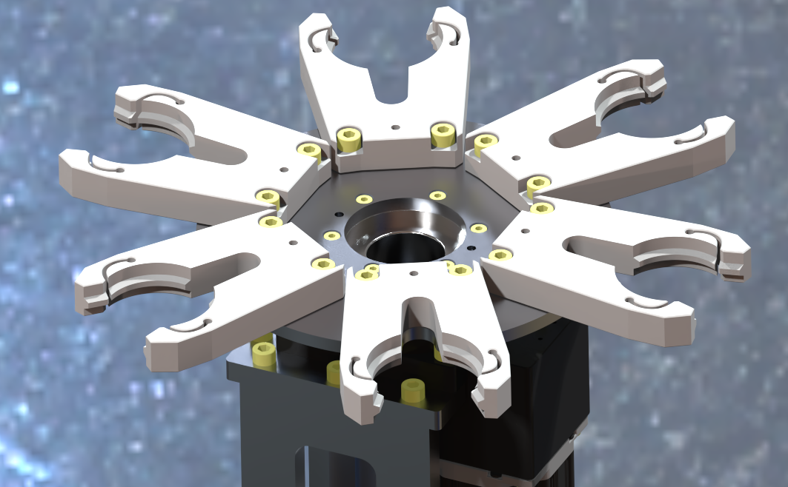
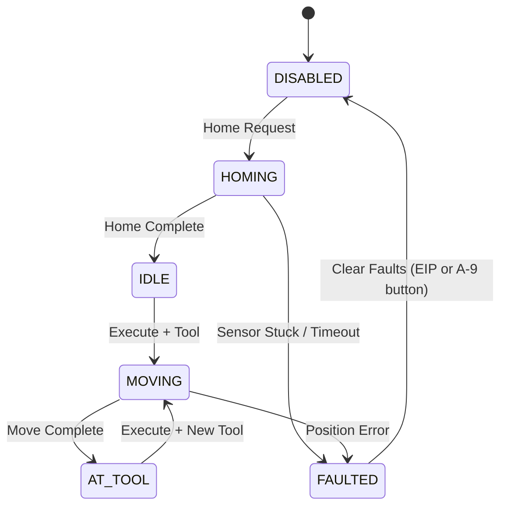

# DX200 Rotary Tool Changer (EtherNet/IP)

<p align="center">
  
</p>

EtherNet/IP adapter firmware for a 6-pocket rotary tool changer, built on a Teknic ClearCore controller and the OpENer open-source EtherNet/IP stack. Designed to interface with a Yaskawa Motoman DX200 robot controller.

## System Overview

A ClearPath SDSK servo motor drives a rotary turret through a 10:1 gearbox. The ClearCore acts as an EtherNet/IP I/O adapter -- the DX200 sends tool select commands over the network and reads back turret status, position, and fault information. A hardware enable input (DI-8) provides a physical interlock for the motor.

### Key Specifications

| Parameter              | Value         |
|------------------------|---------------|
| Motor                  | ClearPath SDSK, Step & Direction |
| Motor Resolution       | 3,600 ppr     |
| Gearbox Ratio          | 10:1          |
| Counts per Revolution  | 36,000        |
| Tool Pockets           | 6             |
| Counts per Pocket      | 6,000         |
| Max Velocity           | 500 RPM / 30,000 pulses/sec (pre-gearbox) |
| Max Acceleration       | 1,000 RPM/s^2 / 60,000 pulses/sec^2 (pre-gearbox) |
| Homing Velocity        | ~33 RPM / 2,000 pulses/sec (pre-gearbox) |

Motion limits are hard-coded in firmware and are not configurable via EtherNet/IP.

---

## Hardware Pin Assignments

| ClearCore Pin | Function                                |
|---------------|-----------------------------------------|
| M-0           | ClearPath SDSK motor (Step & Direction) |
| IO-0          | Stacklight green (firmware-driven)      |
| IO-1          | Stacklight amber (firmware-driven)      |
| IO-2          | Stacklight red (firmware-driven)        |
| IO-3 .. IO-5  | Auxiliary digital outputs (EIP-controlled) |
| DI-6          | Home proximity sensor                   |
| DI-7          | Tool-in-pocket sensor (optional)        |
| DI-8          | Motor enable input (hardware interlock) |
| A-9           | Fault reset pushbutton (rising-edge)    |
| A-10          | E-stop input (normally closed)          |
| A-11 .. A-12  | General-purpose digital inputs          |

### Stacklight (IO-0, IO-1, IO-2)

The stacklight outputs are driven automatically by firmware based on the tool changer state. They cannot be overridden by the robot controller.

| State    | Green (IO-0) | Amber (IO-1) | Red (IO-2) |
|----------|:------------:|:------------:|:----------:|
| DISABLED | off          | off          | off        |
| HOMING   | off          | BLINKING     | off        |
| IDLE     | ON           | off          | off        |
| MOVING   | off          | ON           | off        |
| AT_TOOL  | ON           | off          | off        |
| FAULTED  | off          | off          | ON (solid)  |
| E-STOP   | off          | off          | BLINKING   |

E-stop overrides all other stacklight states. Blink rate: 500 ms on / 500 ms off (same for amber during homing and red during E-stop).

---

## EtherNet/IP Connection

| Setting          | Value                                 |
|------------------|---------------------------------------|
| Input Assembly   | 100 (6 bytes, Tool Changer -> DX200)  |
| Output Assembly  | 150 (3 bytes, DX200 -> Tool Changer)  |
| Config Assembly  | 151 (0 bytes, empty)                  |
| Connection Type  | Exclusive Owner                       |
| Default IP       | 192.168.1.100 (DHCP with static fallback) |

### Output Assembly 150 (3 bytes) -- DX200 to Tool Changer

**Byte 0 -- Tool Select**

Write the desired tool pocket as a simple integer (1-6). Bits 3-7 are reserved.

| Bit(s) | Mask   | Name        | Description              |
|--------|--------|-------------|--------------------------|
| 0-2    | `0x07` | Tool Select | Tool number 1-6          |
| 3-7    |        | Reserved    | --                       |

**Byte 1 -- Command Bits**

| Bit | Mask   | Name         | Description                                     |
|-----|--------|--------------|-------------------------------------------------|
| 0   | `0x01` | Execute      | Rising edge, or tool change while held high     |
| 1   | `0x02` | Home Request | Rising edge starts homing sequence              |
| 2   | `0x04` | Reserved     | Motor enable is via DI-8 hardware input         |
| 3   | `0x08` | Clear Faults | Rising edge clears latched faults               |
| 4-7 |        | Reserved     | --                                               |

**Byte 2 -- Auxiliary Digital Outputs**

| Bit | Output                                                |
|-----|-------------------------------------------------------|
| 0-2 | Reserved (IO-0..IO-2 are stacklight, firmware-driven) |
| 3   | IO-3                                                  |
| 4   | IO-4                                                  |
| 5   | IO-5                                                  |
| 6-7 | Reserved                                              |

### Input Assembly 100 (6 bytes) -- Tool Changer to DX200

**Byte 0 -- Status Bits**

| Bit(s) | Mask   | Name          | Description                                 |
|--------|--------|---------------|---------------------------------------------|
| 0-2    | `0x07` | Current Tool  | Tool number 1-6 (0 = unknown/between tools) |
| 3      | `0x08` | At Position   | Turret settled at the commanded tool        |
| 4      | `0x10` | Home Complete | Homing has completed successfully           |
| 5      | `0x20` | Motor Enabled | Motor is enabled and HLFB asserted          |
| 6      | `0x40` | Fault Present | One or more faults active (see bytes 2-3)   |
| 7      | `0x80` | In Motion     | Turret is currently rotating                |

**Byte 1 -- State, Info Codes & Tool In Pocket**

| Bit(s) | Mask   | Name           | Description                                           |
|--------|--------|----------------|-------------------------------------------------------|
| 0-2    | `0x07` | State          | State machine value (see below)                       |
| 3      | `0x08` | Invalid Tool   | Out-of-range tool requested. Non-fatal, self-clearing |
| 4      | `0x10` | Not Ready      | Command ignored (wrong state). Non-fatal, self-clearing |
| 5      | `0x20` | E-Stop Active  | A-10 NC input low -- motor enable blocked              |
| 6      | `0x40` | Tool In Pocket | DI-7 sensor: 1 = tool present in current pocket       |
| 7      |        | Reserved       | --                                                     |

State machine values (bits 0-2):

| Value | State    | Description                        |
|-------|----------|------------------------------------|
| 0     | DISABLED | Motor disabled, no motion allowed  |
| 1     | HOMING   | Homing sequence in progress        |
| 2     | IDLE     | Homed and ready, awaiting command  |
| 3     | MOVING   | Rotating to requested tool pocket  |
| 4     | AT_TOOL  | At requested tool, move complete   |
| 5     | FAULTED  | Fault detected, motion inhibited   |

**Bytes 2-3 -- Fault Code** (UINT16, little-endian bitmask)

| Bit | Code     | Name              | Description                                          |
|-----|----------|-------------------|------------------------------------------------------|
| 0   | `0x0001` | Motor Alert       | ClearPath alert register is active                   |
| 1   | `0x0002` | HLFB Timeout      | HLFB not asserted after enable, move timeout, or unexpected loss |
| 2   | `0x0004` | Home Failed       | Homing sequence did not complete                     |
| 3   | `0x0008` | Position Error    | Position not at expected tool pocket after move      |
| 4   | `0x0010` | *(reserved)*      | --                                                    |
| 5   | `0x0020` | Home Sensor Stuck | DI-6 did not clear within one pocket width (6,000 counts) |

**Byte 4 -- Current Tool Pocket**

Full-byte integer (1-6, or 0 if unknown). No bit masking required.

**Byte 5 -- Digital Inputs**

| Bit | Input                 |
|-----|-----------------------|
| 0   | DI-6 (home sensor)    |
| 1   | DI-7 (tool in pocket) |
| 2   | DI-8 (motor enable)   |
| 3   | A-9 (fault reset btn) |
| 4   | A-10 (E-stop, NC)     |
| 5   | A-11                  |
| 6   | A-12                  |
| 7   | Reserved              |

---

## State Machine



> **DI-8 / E-stop / connection loss:** Any active state transitions to DISABLED immediately when DI-8 goes low, E-stop is activated (A-10 low), or the EtherNet/IP connection is lost. DI-8 must be cycled (low then high) to re-enable. E-stop must be released first.

### Typical Command Sequence

1. Assert DI-8 (hardware enable) -- motor enables automatically
2. Wait for Motor Enabled (input byte 0, bit 5)
3. Set Home Request: write byte 1 = `0x02`
4. Wait for Home Complete (input byte 0, bit 4) and state = IDLE
5. Write tool number to byte 0 (e.g. `3`), set Execute: write byte 1 = `0x01`
6. Wait for At Position (input byte 0, bit 3) and state = AT_TOOL
7. To change tools: write new tool number to byte 0 while Execute stays high

### Homing Sequence

If the turret is already on the home sensor (DI-6) when homing starts, it moves off the sensor first (max 6,000 counts / one pocket width). If DI-6 does not clear within that distance, a **Home Sensor Stuck** fault is raised. Once clear, the turret reverses slowly to find the sensor edge and zeros the position. Tool 1 is defined as the home position. If the sensor is not found within 30 seconds, a **Home Failed** fault is raised.

### Safety Behavior

- **E-stop (A-10, normally closed)**: When A-10 goes LOW (button pressed or wire broken), all motion is stopped immediately and the motor is disabled. While the E-stop is active, motor enable is blocked -- DI-8 rising edges are ignored. When the E-stop is released, the system stays in DISABLED; DI-8 must be cycled (low then high) to re-enable. E-stop status is reported in input byte 1, bit 5.
- **DI-8 hardware enable**: Rising edge enables (unless E-stop is active or faulted), falling edge immediately stops motion and disables. DI-8 state is visible in input byte 5, bit 2.
- **Connection loss**: Motor is disabled if the EtherNet/IP connection drops. DI-8 must be cycled to re-enable after reconnection.
- **Fault reset -- two paths, same result**:
  - **EtherNet/IP**: Rising edge on Clear Faults (output byte 1, bit 3).
  - **Physical button**: Rising edge on A-9 (wired as a normally-open pushbutton). Works even without an active EIP connection.
  - Both paths call the same recovery sequence: stop motion, disable motor, clear ClearPath alerts, reset the state machine to DISABLED, then re-enable the motor if DI-8 is still asserted. The firmware temporarily overrides DI-8 during this sequence so the enable can be cycled cleanly.
- **Execute behavior**: Triggers on rising edge OR tool number change while held high. This allows the DX200 to hold Execute and simply write new tool numbers to byte 0.
- **Home / Clear Faults**: Rising-edge triggered only.
- **Homing timeout**: If the home sensor (DI-6) is not found within 30 seconds, a Home Failed fault is raised.
- **HLFB timeout** (fault code `0x0002`): Three detection scenarios:
  - **Post-enable**: After DI-8 enables the motor, HLFB must assert within 2 seconds. If it doesn't, the motor is disabled and a fault is raised. Detects: motor not connected, wiring fault, drive not configured.
  - **Move completion**: A tool-change move must complete within 5 seconds. If it doesn't, motion is stopped and a fault is raised. Detects: mechanical jam, stall, lost steps.
  - **Unexpected loss**: While in IDLE or AT_TOOL, HLFB must remain asserted. If it drops for more than 100 ms, a fault is raised. Detects: power loss, intermittent wiring, drive fault without alert bit.
- **Invalid tool numbers** (0 or 7): Silently ignored with an informational code in byte 1 -- no fault, no motion.
- **DI-8 while faulted**: Rising edge is ignored. Clear faults first.
- **Fault clear during E-stop**: Faults can be cleared while E-stop is active, but the motor will not re-enable until E-stop is released and DI-8 is cycled.

---

## ClearPath Motor Configuration (MSP Software)

These settings must be configured in the ClearPath motor using Teknic's MSP (Motor Setup Program) software before operation:

| Setting               | Value                            |
|-----------------------|----------------------------------|
| Mode                  | Step and Direction               |
| Input Format          | Step + Direction                 |
| Input Resolution      | 3,600 counts/rev                 |
| HLFB Mode             | ASG-Position w/ Measured Torque  |
| PWM Carrier Frequency | 482 Hz                           |

---

## Serial Diagnostics

The ClearCore USB serial port (115200 baud) provides real-time diagnostic output for commissioning and troubleshooting. Connect a terminal (PuTTY, Tera Term, etc.) to the ClearCore's USB port.

### Startup Banner

Printed once at power-on. Shows hardware configuration, network initialization, and OpENer stack status.

```
========================================
  DX200 Rotary Tool Changer -- ClearCore
  SDSK 3600ppr | 10:1 Gearbox | 6 Pockets
========================================

Motor M-0 configured (Step+Dir, HLFB bipolar PWM)
Waiting for Ethernet link...
Ethernet link detected!

Initializing network (OpENer will load saved config or use defaults)...
DHCP successful (default, may be overridden by saved config)
IP Address: 172.16.82.113

--- Initializing OpENer ---

OpENer init: SUCCESS (g_end_stack=0)

--- Initialization complete -- entering main loop ---
```

If Ethernet link is not detected within 5 seconds, the firmware halts with `ERROR: Ethernet link timeout!`.

### Network Link Messages

Printed only on state transitions -- not repeated while stable.

| Message | Meaning |
|---------|---------|
| `NET: Link UP  IP=x.x.x.x` | Ethernet link established (or recovered) |
| `NET: Link UP  (no IP yet)` | Link up but IP not yet assigned |
| `NET: Link DOWN` | Ethernet cable disconnected or switch port down |

### Periodic Status Line

Printed every 5 seconds. Shows the current tool changer state at a glance.

```
TC:  State=IDLE Tool=1 Pos=0 Fault=0x0000
```

| Field | Description |
|-------|-------------|
| `State` | Current state machine state: DISABLED, HOMING, IDLE, MOVING, AT_TOOL, FAULTED |
| `Tool` | Current tool pocket (1-6, or 0 if unknown) |
| `Pos` | Normalised turret position in encoder counts (0-35999) |
| `Fault` | Active fault bitmask (see Fault Code table above) |

### Tool Changer Event Messages (`TC_LOG`)

These messages are printed immediately when events occur, independent of the OpENer trace level. All are prefixed with `TC_` for easy filtering.

**Initialization**

| Message | When |
|---------|------|
| `TC_Init: State machine reset (DI-8 = enable, ...)` | Power-on or after `ToolChanger_Initialize()` |

**Motor Enable / Disable**

| Message | When |
|---------|------|
| `TC: Motor enable requested, awaiting HLFB (timeout Nms)` | DI-8 rising edge accepted |
| `TC: Motor disabled (state=N)` | DI-8 falling edge or programmatic disable |
| `TC_Cyclic: DI-8 high -> motor enabled` | DI-8 asserted, motor enabling |
| `TC_Cyclic: DI-8 low -> motor disabled` | DI-8 released, emergency stop |
| `TC_Cyclic: DI-8 rising edge ignored (E-stop active)` | DI-8 blocked by E-stop |
| `TC_Cyclic: DI-8 rising edge ignored (clear faults first)` | DI-8 blocked by active fault |

**HLFB (High-Level Feedback)**

| Message | When |
|---------|------|
| `TC_Cyclic: HLFB asserted after enable (Nms)` | Motor confirmed ready after enable |
| `TC_Cyclic: HLFB TIMEOUT after enable -- ... N ms` | Motor did not respond within 2 seconds |
| `TC_Cyclic: HLFB LOST in IDLE -- deasserted for >100 ms` | Unexpected HLFB drop while idle |
| `TC_Cyclic: HLFB LOST in AT_TOOL -- deasserted for >100 ms` | Unexpected HLFB drop while at tool |

**Homing**

| Message | When |
|---------|------|
| `TC_HomeStart: Homing started, seeking DI-6 sensor` | Normal homing begins |
| `TC_HomeStart: Already on sensor, moving off (max N counts)` | Turret on sensor at start, moving off first |
| `TC_HomeStart: Cannot home while faulted` | Home request rejected |
| `TC_HomeStart: Motor not ready (assert DI-8 to enable)` | Home request rejected, motor not enabled |
| `TC_Cyclic: Cleared home sensor, now seeking edge` | Phase 0 complete, reversing to find edge |
| `TC_Cyclic: Home sensor detected. Position zeroed. At Tool 1.` | Homing complete |
| `TC_Cyclic: HOME SENSOR STUCK -- DI-6 did not clear within N counts` | Fault: sensor didn't clear |
| `TC_Cyclic: HOMING TIMEOUT -- sensor not found within N ms` | Fault: 30-second timeout expired |

**Tool Selection & Motion**

| Message | When |
|---------|------|
| `TC_SelectTool: Moving to tool N (delta=N counts, dir=CW/CCW)` | Move command issued |
| `TC_SelectTool: Already at tool N` | Requested tool is current position |
| `TC_SelectTool: Ignored invalid tool N (must be 1-6)` | Out-of-range tool number |
| `TC_SelectTool: Not ready (state=N)` | Command rejected (wrong state) |
| `TC_Cyclic: Arrived at tool N (pos=N)` | Move complete, at target |
| `TC_Cyclic: Position error! Expected tool N, at tool N (pos=N)` | Fault: wrong position after move |
| `TC_Cyclic: MOVE TIMEOUT -- move did not complete within N ms` | Fault: 5-second move timeout |

**E-Stop**

| Message | When |
|---------|------|
| `TC_Cyclic: E-STOP ACTIVE (A-10 low) -> motor disabled` | E-stop engaged |
| `TC_Cyclic: E-stop released (A-10 high), cycle DI-8 to re-enable` | E-stop cleared |

**Fault Reset**

| Message | When |
|---------|------|
| `TC_Cyclic: A-9 button pressed -> clearing faults` | Physical fault reset button |
| `TC_Cyclic: Motor alert detected! Faulted.` | ClearPath alert triggered |
| `TC_ClearFaults: Faults cleared, state -> DISABLED, DI-8=N, ...` | Fault clear sequence complete |

### OpENer Stack Traces

In the **Debug** build configuration, OpENer error and warning messages are also printed (prefixed by the OpENer trace system). These cover EtherNet/IP protocol-level events such as connection failures, CIP service errors, and configuration changes. In the **Release** build, only OpENer errors are printed.

| Build Config | OpENer Trace Level | What Prints |
|-------------|-------------------|-------------|
| Release | `0x01` | Errors only |
| Debug | `0x03` | Errors + Warnings |

Tool changer `TC_LOG` messages always print regardless of build configuration or trace level.

---

## Project Structure

```
ClearCore_DX200_ToolChanger/
├── README.md                              # This file
├── DX200_ToolChanger/                     # Main firmware project
│   ├── DX200_ToolChanger.atsln            # Microchip Studio solution
│   ├── DX200_ToolChanger.cppproj          # Microchip Studio project
│   ├── main.cpp                           # Entry point, motor init, main loop
│   ├── Device_Startup/                    # Startup code & linker scripts
│   │   ├── flash_with_bootloader.ld       # Linker script (active)
│   │   └── startup_same53.c              # Vector table & default handlers
│   ├── OpENer/                            # OpENer EtherNet/IP stack
│   │   └── source/src/ports/ClearCore/
│   │       ├── devicedata.h               # CIP identity (product name, vendor)
│   │       ├── clearcore_wrapper.h        # Tool changer API (C-compatible)
│   │       ├── clearcore_wrapper.cpp      # Motor control, state machine, I/O
│   │       └── dx200_toolchanger/
│   │           ├── dx200_toolchanger.c    # EIP assembly definitions & logic
│   │           └── opener_user_conf.h     # OpENer stack configuration
│   └── lwip-master/                       # lwIP TCP/IP stack
├── libClearCore/                          # ClearCore SDK / HAL
├── LwIP/                                  # LwIP library build
└── Tools/                                 # Build tools (bossac, uf2-builder)
```

### Key Source Files

| File | Purpose |
|------|---------|
| `main.cpp` | Motor hardware init, network setup, main cyclic loop |
| `devicedata.h` | CIP Identity: product name, vendor ID, device type, revision |
| `clearcore_wrapper.h` | Public API: constants, enums, function declarations |
| `clearcore_wrapper.cpp` | Tool changer implementation: state machine, motion control, homing, fault handling, DI-8 enable logic |
| `dx200_toolchanger.c` | EtherNet/IP assembly objects, command processing, status reporting, stacklight |
| `opener_user_conf.h` | OpENer stack compile-time configuration (buffer sizes, features) |

## Building

The project is built using Microchip Studio (Atmel Studio 7). The solution (`DX200_ToolChanger.atsln`) contains three projects:

| Project | Output | Description |
|---------|--------|-------------|
| **DX200_ToolChanger** | Executable (.elf) | Main firmware -- startup project |
| **ClearCore** | Static library | ClearCore HAL (provides `Reset_Handler`, `SystemInit`) |
| **LwIP** | Static library | lwIP TCP/IP stack |

### Build Steps

1. Open `DX200_ToolChanger/DX200_ToolChanger.atsln` in Microchip Studio
2. Set **DX200_ToolChanger** as the startup project
3. Build the solution (F7) and flash to the ClearCore via USB

### Build Notes

- The linker script is `Device_Startup/flash_with_bootloader.ld` (ARM-standard symbols, 16 KB bootloader offset).
- `Device_Startup/system_same53.c` is excluded from the build -- `SystemInit` and `SystemCoreClock` are provided by the ClearCore library.
- `Device_Startup/startup_same53.c` provides the interrupt vector table and weak default handlers; the ClearCore library provides `Reset_Handler` (in `SysManager.cpp`).

## License & Attribution

The DX200 Tool Changer application code is copyright Adam G. Sweeney and released under the **MIT License**. 
See [LICENSE](LICENSE) for the full text.

This project incorporates the following third-party components, each under their own license:

| Component | License | Copyright | File |
|-----------|---------|-----------|------|
| **OpENer** EtherNet/IP stack | Adapted BSD | (c) 2009 Rockwell Automation, Inc. / ODVA | [`OpENer/license.txt`](DX200_ToolChanger/OpENer/license.txt) |
| **libClearCore** HAL | MIT | (c) 2019 Teknic, Inc. | [`libClearCore/license.txt`](libClearCore/license.txt) |
| **lwIP** TCP/IP stack | BSD | See file | [`lwip-master/COPYING`](DX200_ToolChanger/lwip-master/COPYING) |

`dx200_toolchanger.c` is derived from OpENer's sample application and carries both the original Rockwell Automation copyright and the MIT license for modifications.
